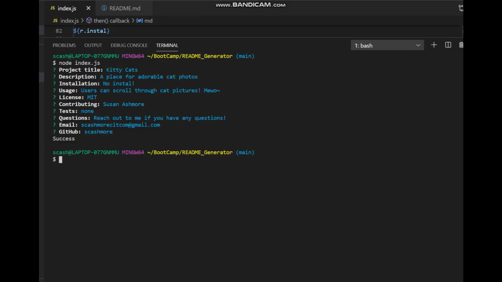

# README_Generator

## Description

This application aims to allow users to quickly generate md files for their projects.

## Use

A link to a video displaying how to use this application: https://drive.google.com/file/d/1I6s0Myd6RUQ23d9ZxqKC9NJ3w29_giUS/view?usp=sharing

Users must access this application at the root via the command line. inquirer must be installed as well. A user can then type "node index.js" into the command line. The user will be promted for the project title, a description of the projects, nessecary instals, license, contributers, tests, questions, email, and their github account.

